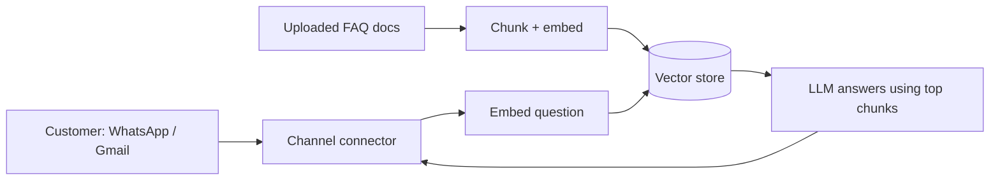
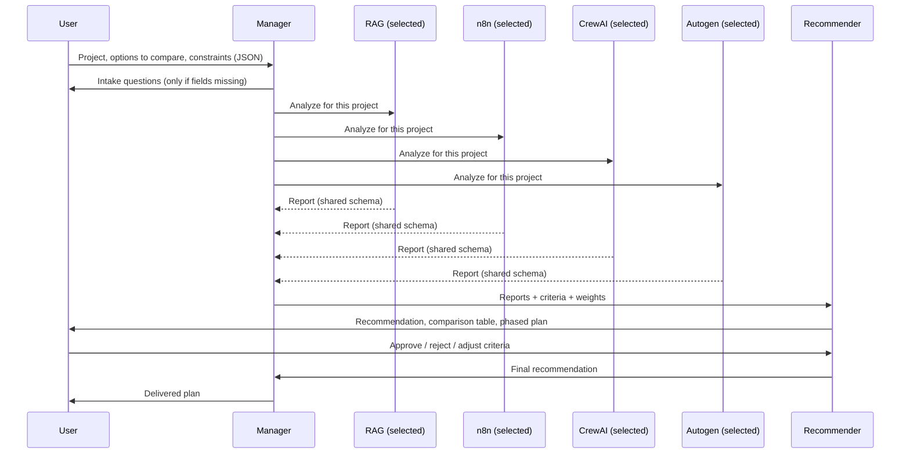

# Multi‑Agent Framework Advisor for Small / Micro Customer‑Support Projects

## Goal Description
Build a lightweight multi‑agent system in Python (**Autogen**) that helps the owner of a **small or micro customer‑support project** decide which framework (or combination) to use: **RAG, n8n, CrewAI, Autogen**.

The **user decides what to compare** and what matters to them. The **automation analyzes** each chosen option against the project. **Agent 6** then scores the options against clear criteria and **suggests** the best fit (or a combination), with a phased plan the user can follow. The user approves, rejects, or asks for changes.

> Key idea: these options are not always alternatives. RAG is a technique, n8n is a workflow tool, CrewAI/Autogen are agent frameworks. For micro projects they are often **combined** (e.g. n8n + RAG), so Agent 6 may recommend a stack, not a single winner.

## User Review Required
> [!IMPORTANT] **Deployment language & environment**
> - Python. Runs locally; Docker is optional.
>
> [!IMPORTANT] **Human‑in‑the‑loop interaction**
> - Chat‑style FastAPI endpoint (JSON in / JSON out). UI rendering added later.
>
> [!WARNING] **Security & credentials**
> - API keys (e.g. `OPENAI_API_KEY`) live in `.env`, loaded with `python‑dotenv`, and are excluded from version control.
>
> [!NOTE] **Autogen version**
> - Target the current AutoGen (`autogen-agentchat` 0.4+). Confirm exact class names against the installed version before coding; do not rely on `SQLiteMessageStore` / `ConversationHistory` names from older releases.

---
## How It Works (Flow)

1. **User input** – the user describes the project, lists the options they have in mind, and optionally sets criteria/weights.
2. **Manager** – runs only the knowledge agents for the options the user selected.
3. **Analysis (Agents 1, 2, 3, 5)** – each selected agent analyzes its framework *against this specific project* and returns a structured report.
4. **Suggestion (Agent 6)** – scores the reports against the criteria, flags any hard‑limit failures, and recommends one option or a combination with a phased plan.
5. **User decision** – approve / reject / adjust criteria and re‑run.

### User Input Format (JSON)
```json
{
  "project_description": "WhatsApp + Gmail support bot answering from uploaded FAQs",
  "options_to_compare": ["rag", "n8n", "crewai", "autogen"],
  "requirements": {
    "channels": ["gmail", "whatsapp"],
    "document_upload": true,
    "messages_per_day": 100,
    "human_approval_of_replies": false
  },
  "constraints": {
    "budget_per_day_usd": 2,
    "max_latency_ms": 1000,
    "min_recall": 0.9,
    "user_skill": "low-code",
    "time_available": "1 week"
  },
  "weights": null
}
```
- `options_to_compare`: any subset of `rag`, `n8n`, `crewai`, `autogen`.
- `constraints` and `weights` are optional; defaults below apply when omitted.
- `weights: null` means use the default weights.

### Intake Questions (asked if fields are missing)
- Which channels are needed (Gmail, WhatsApp, other messaging, web chat)?
- Roughly how many messages per day?
- What documents will be uploaded, and how many?
- Should a human approve replies before sending?
- Daily budget and acceptable response time?
- Coding skill and time available?

---
## Evaluation Criteria (Agent 6)

Weighted scoring, 0–10 per criterion. Defaults can be overridden by the user.

| Criterion | Default weight | What it checks |
|---|---|---|
| Fit to requirements | 30% | Covers the listed channels, documents, approval needs |
| Cost | 25% | Estimated daily cost vs budget (default ≤ $2/day) |
| Setup effort & skill | 20% | Matches user skill and available time |
| Latency | 15% | Estimated response time vs target (default ≤ 1000 ms) |
| Long‑term benefit | 10% | Maintainability, extensibility (scalability not required) |

**Hard limits** (defaults): recall ≥ 0.9 (only for options involving document retrieval), latency ≤ 1000 ms, budget ≤ $2/day. An option that fails a hard limit is **flagged and ranked below options that pass**, regardless of weighted score.

**Notes on measurability** – the agents produce *estimates*, not benchmarks:
- Cost: estimated from `messages_per_day` × typical tokens/call × model price.
- Latency: typical published/observed ranges; note that an LLM call in the path may make ≤ 1000 ms unrealistic.
- Recall: cannot be measured by the agents. Agent 6 includes a **validation checklist** (20–30 test questions with known answers) for the user to confirm recall ≥ 0.9 on the chosen stack.

---
## Proposed Changes

### Core Project Structure
#### [NEW] project_root/
- `README.md` – overview, setup, usage.
- `requirements.txt` – `autogen-agentchat`, `fastapi`, `uvicorn`, `python-dotenv`, `pyyaml`, `pytest`, `pytest-asyncio`, `httpx`.
- `run_manager.py` – entry point; reads the user input JSON and starts the manager.
- `agents/` – agent implementations.
- `.env.example` – required environment variables.
- `config.yaml` – model, timeout, default criteria and weights.

---
### Agent Implementations

#### [NEW] agents/manager.py – Manager (Agent 0)
- Validates the user input; asks intake questions for missing fields.
- Includes its own **simple design and "how it works"** in the final delivery: a short diagram of which agents ran for this project and how the request moved through them.
- Dispatches tasks **only to the selected** knowledge agents, in parallel.
- Collects reports and forwards them, with the criteria, to Agent 6.

#### [NEW] agents/knowledge_base.py – Base class (Agents 1, 2, 3, 5)
- Common utilities: prompt templates, logging, `.env` loading, and a shared **report schema**.
- Sub‑classes set `framework_name` and `knowledge_content`.

**Shared report schema** (every knowledge agent returns the same fields so Agent 6 can compare them):
- `summary` – what it is, in plain language for a non‑expert.
- `fit_to_requirements` – which of the user's needs it covers / does not cover.
- `setup_effort` – steps, time estimate, skill needed.
- `estimated_daily_cost_usd` – with the assumptions shown.
- `estimated_latency_ms` – typical range.
- `risks` – e.g. WhatsApp Business API approval, Gmail OAuth, rate limits.
- `works_well_with` – other options it combines with.
- `simple_design` – **required.** A small Mermaid diagram (5–8 nodes max) showing the components and data flow, built from the user's own project details (channels, documents, volume, approval step). No generic diagrams.
- `how_it_works` – **required.** A numbered walkthrough (4–7 steps) of one real request from the user's project, e.g. *"Customer sends a WhatsApp message → ... → reply sent"*, naming the concrete tools/components used at each step.
- `project_specific_notes` – what to configure for this project (which channel connectors, where uploaded documents go, where the approval step sits, expected message volume handling).

**Rule for all agents:** `simple_design` and `how_it_works` must reference the fields in the user's input (`channels`, `document_upload`, `messages_per_day`, `human_approval_of_replies`, `user_skill`). If a field is missing, the agent states its assumption instead of guessing silently.

**Example (RAG agent, input: WhatsApp + Gmail, uploaded FAQs, 100 msgs/day, no approval)**

How it works: 1) FAQs are uploaded once, split into chunks and embedded into the vector store. 2) A customer message arrives from WhatsApp or Gmail. 3) The question is embedded and the top 3–5 matching chunks are retrieved. 4) The LLM writes a reply using only those chunks. 5) The reply is sent back on the same channel. At 100 msgs/day this is one small LLM call per message.

#### [NEW] agents/rag_agent.py – Agent 1 (RAG)
Answering from uploaded documents/FAQs; retrieval quality, chunking, vector store options, cost of embeddings.

#### [NEW] agents/n8n_agent.py – Agent 2 (n8n)
Workflow automation and connectors (Gmail, WhatsApp, messaging); triggers, self‑host vs cloud, sample flow.

#### [NEW] agents/crewai_agent.py – Agent 3 (CrewAI)
Role‑based multi‑agent crews; when multi‑step reasoning is worth the extra complexity; minimal crew design.

#### [NEW] agents/autogen_agent.py – Agent 5 (Autogen)
Conversational multi‑agent orchestration; when it is justified for a micro project; minimal example.

#### [NEW] agents/human_loop_agent.py – Agent 6 (Recommender)
- Receives the reports, the user's constraints and the weights.
- Computes the weighted scores, applies the hard‑limit checks, and produces a **markdown comparison table**.
- Recommends **one option or a combination** and returns a **phased plan**.
- Exposes a FastAPI `/chat` endpoint; the user replies `approve`, `reject`, or changes criteria and Agent 6 re‑scores.

**Agent 6 output template**
1. Recommended stack and why (one short paragraph).
2. Comparison table (scores per criterion, hard‑limit flags).
3. **Simple design of the recommended stack** – one Mermaid diagram combining the chosen options for this project, plus a numbered **"how it works"** walkthrough of one real customer request (built from the user's channels, documents, volume and approval setting).
4. Phased plan with time estimates (Day 1, Week 1, ...).
5. Estimated monthly cost.
6. "When to upgrade" triggers (e.g. volume above X, need for multiple cooperating agents).
7. Risks and preparation (API keys, WhatsApp Business setup, sample documents).
8. Recall validation checklist (if retrieval is involved).

---
### System Prompt Templates

- **Manager (Agent 0)**:
  *You coordinate a framework‑selection workflow for a small customer‑support project. Validate the user's input, run only the frameworks they chose, and pass the reports and criteria to Agent 6.*

- **RAG Agent (Agent 1)**:
  *You are an expert on Retrieval‑Augmented Generation. Analyze how well RAG fits the user's project. Return the shared report schema with honest estimates and assumptions. Always include a simple Mermaid design and a numbered "how it works" walkthrough built from the user's project details.*

- **n8n Agent (Agent 2)**:
  *You are an n8n specialist. Analyze how well n8n fits the user's channels and workflow needs. Return the shared report schema with honest estimates and assumptions.*

- **CrewAI Agent (Agent 3)**:
  *You are a CrewAI advisor. Analyze whether a multi‑agent crew is worth it for this small project. Return the shared report schema with honest estimates and assumptions.*

- **Autogen Agent (Agent 5)**:
  *You are an Autogen guide. Analyze whether Autogen is justified for this small project. Return the shared report schema with honest estimates and assumptions.*

- **Note:** the Agent 2, 3 and 5 prompts above also end with: *Always include a simple Mermaid design and a numbered "how it works" walkthrough built from the user's project details.*

- **Recommender (Agent 6)**:
  *You are the recommender. Include a simple design and "how it works" walkthrough of the recommended stack for this project. Score the reports against the user's criteria and weights, flag hard‑limit failures, and recommend one option or a combination with a phased plan. State assumptions clearly. Wait for the user's approval, rejection, or changes via chat.*

---
### Memory, Logging & Persistence (kept minimal for small projects)

- Short‑term context uses Autogen's default in‑memory message handling; memory is cleared after each evaluation cycle.
- One log file `logs/agents.jsonl`: a JSON line per interaction with `agent_id`, `timestamp`, `status` (`running` / `completed` / `error`), `message`.
- One SQLite database `agent_reports.db` stores each run's input, reports and final recommendation for later review.
- A simple `/status` endpoint returns the last log entry per agent; the manager retries an agent once if it times out.
- Per‑agent stores, heartbeats and Docker are **optional**, not required for the micro‑project use case.
- Memory footprint: ~200 MB total is sufficient.

---
### Interaction Flow
#### [NEW] agents/dialogue_flow.md

Only the agents the user selected take part; the others are skipped.

---
### Configuration & Deployment
#### [NEW] config.yaml
```yaml
model: gpt-4o-mini           # can be overridden via env var
temperature: 0.2
max_tokens: 2048
parallel: true               # run selected knowledge agents concurrently
timeout_seconds: 30

default_constraints:
  budget_per_day_usd: 2
  max_latency_ms: 1000
  min_recall: 0.9

default_weights:
  fit_to_requirements: 0.30
  cost: 0.25
  setup_effort: 0.20
  latency: 0.15
  long_term_benefit: 0.10
```

#### [NEW] .env.example
```dotenv
# OpenAI API key (required for all agents that call LLMs)
OPENAI_API_KEY=your-key-here
# Optional Anthropic key
ANTHROPIC_API_KEY=your-key-here
```
- Copy to `.env` and **never commit** it.

#### Docker (optional)
- `Dockerfile` on `python:3.11-slim`, running `uvicorn agents.human_loop_agent:app --host 0.0.0.0 --port 8000`.
- `docker-compose.yml` mounts a local `.env`.

---
### Verification Plan
#### Automated Tests
- Unit tests per knowledge agent (mock LLM): output matches the shared report schema.
- Scoring tests for Agent 6: weighted totals are correct, hard‑limit failures are flagged and ranked below passing options, custom weights are honored.
- Manager test: only the selected agents are invoked.
- Integration test: run `run_manager.py` with a sample input, then POST to `/chat` and check for a non‑empty recommendation JSON.
- Tools: `pytest`, `pytest-asyncio`, `httpx`.

#### Manual Verification
- Start the server (`uvicorn agents.human_loop_agent:app`).
- Submit the sample input with all four options, then with only two, and confirm the output changes accordingly.
- Send `approve`, then `reject` with a changed budget, and confirm re‑scoring.

---
### Documentation & Samples
- `docs/` – generated markdown per framework from the agents' reports.
- `example_project/` – minimal customer‑support bot scaffold for the recommended stack.
- `samples/` – example input JSON files (e.g. WhatsApp + FAQ bot, Gmail auto‑reply).

---
## Open Questions
- Which existing data sources (knowledge base, FAQ documents) will the first project use?
- Are the default weights acceptable, or should any criterion change?
- Should Agent 6 be allowed to recommend a combination of options, or only a single option? (Default: combinations allowed.)

## Next Steps
1. Confirm the open questions above.
2. Place API keys in `.env`.
3. Approve this plan so implementation can begin.
