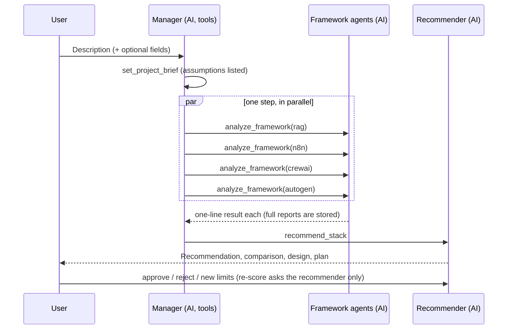

# Dialogue flow

Only the options the user chose are analyzed. The manager decides the order and what to call; the tools refuse
calls that break the rules and the code reminds the manager once if it stops early.
